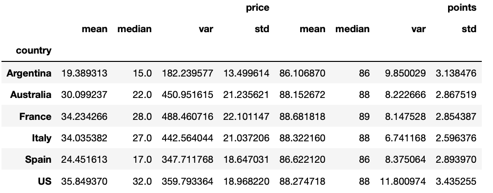
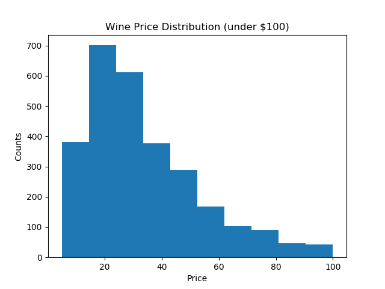
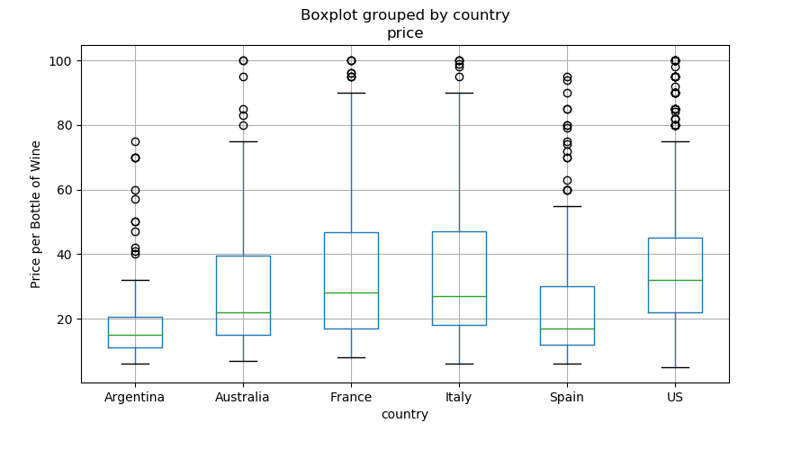
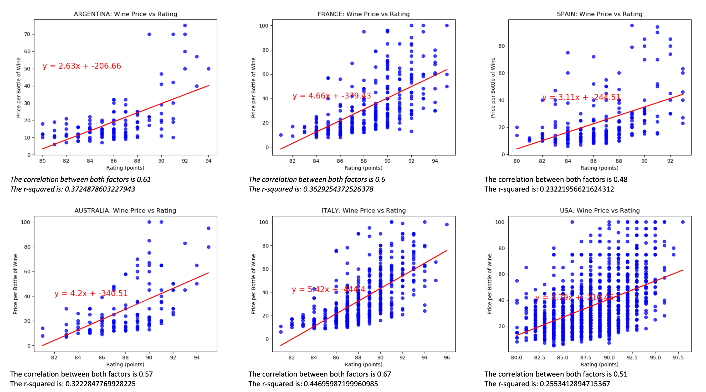
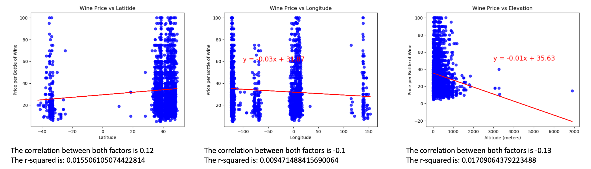
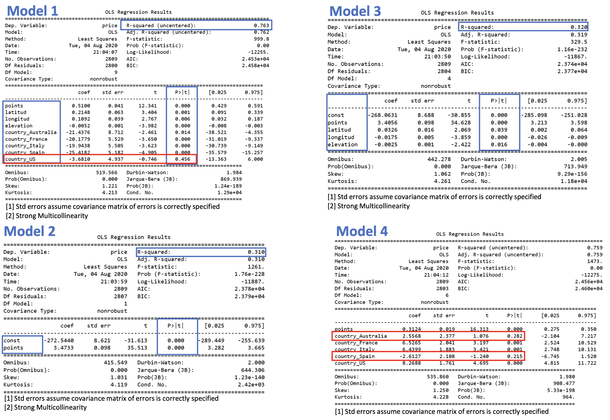

# Wine Pricing Forecast
Statistical analysis to predict the price of wine applying multiple regression, based on different factors as points, longitude, altitude, elevation and price by country.

Locate on a heat map the provinces of the wineries and display the points and price of the bottles of wine.

## Description

1. Starter.ipynb

  * Run Starter.ipynb on Jupyter Notebook to explore the detail of the analysis.
  * Use the file winemag-data_first150k.csv as origin of data.

2. Google API´s

  * Use the Google Geocoding API https://maps.googleapis.com/maps/api/geocode/json to get the latitude and longitude of the wineries
  * Use the Google Elevation API https://maps.googleapis.com/maps/api/geocode/json to get the elevation of the wineries

## Visualization

### Summary statistics

### Histogram for price

### Boxplot by country price

### Linear regression Price VS Points (by country)

### Linear regression Price VS Latitude, Longitude, Elevation

### Regression models

## Team members

1. Eduardo Garza
2. Cintia Mercado
3. Mariana Revilla
